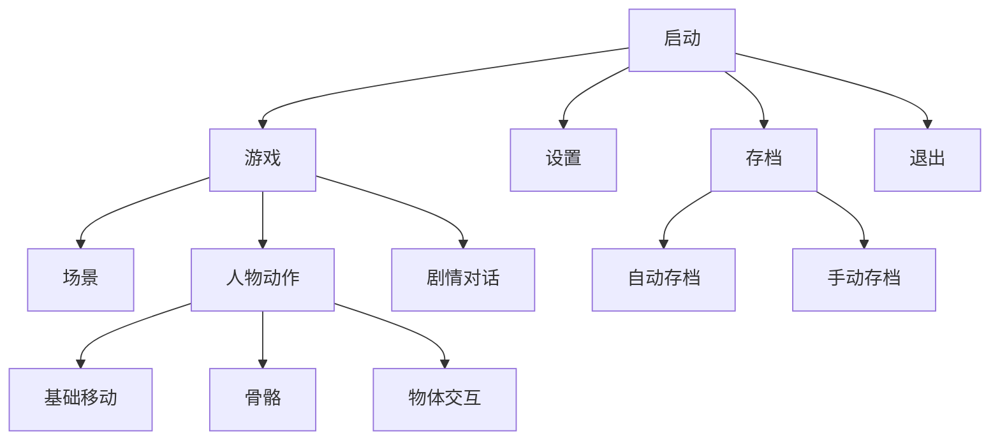
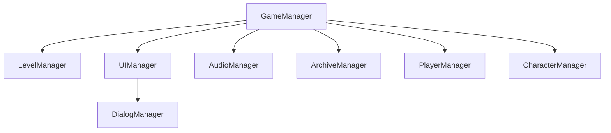

# 某游戏开发程序部分提纲

[《提亚马特与一份名单》](https://github.com/NJUCACGameMaker/Tiamat-and-the-list)（暂定）目前基本定位在剧情向解密平台游戏。在目前正式版策划案及场景元素美工还没有出来时，程序开发暂时做出如下规划。

## 项目结构



## 代码结构



### GameManager

游戏整体管理，管理加载顺序（？），游戏设置，进度等存储。

### LevelManager

负责管理关卡，每个关卡唯一对应一个不同的LevelManager，每一关卡会由多个Scene构成（感觉还是有问题）。LevelManager管理关卡中所有场景物品和可触发物品的状态，场景物品的状态位置更改必须经由它处理。
另外，当前玩家角色所持有道具的状态等也由LevelManager控制。
也管理场景转换，过场动画的触发。

### UIManager

管理当前Scene所有UI层的UI。负责其显示切换，浮窗显现，控制交互等。

### AudioManager

管理当前场景的音乐播放，音效触发，对话语音播放。

### ArchiveManager

管理游戏存档的保存与加载，无存档时加载默认配置配置场景。

### PlayerManager

玩家角色控制

### CharacterManager

管理NPC

## 对话的存储加载

对话通过读取解析文本直接控制，单条对话的文本格式如下

```Text
对话人|文本内容|使用图片或立绘名|分支数（若无分支记为0）(|分支内容|分支跳转行)*n
```

对于一段连续的对话（包括仅一句对话的情况），以独立成行的id开始，以一个空行为结束。
两段对话的例子

```Text
0
秋濑或|雪辉，你都做了什么?|秋濑或-A|0
雪辉|成神，我已经是神了，秋濑君|雪辉-A|0
秋濑或|为了成神，你就杀了关心着你的朋友吗|秋濑或-B|0

1
秋濑或|在由乃家我发现了三具尸体，其中一具就是由乃|秋濑或-C|0
```